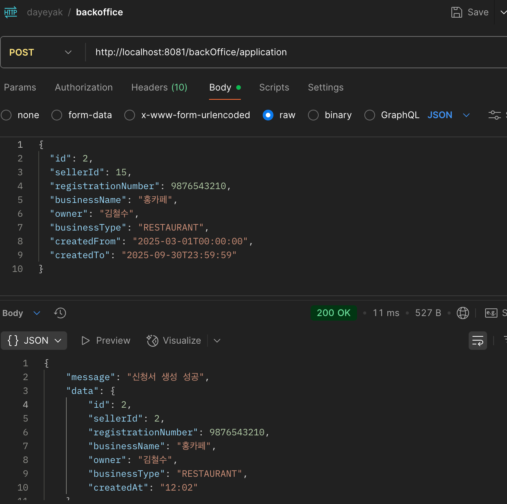
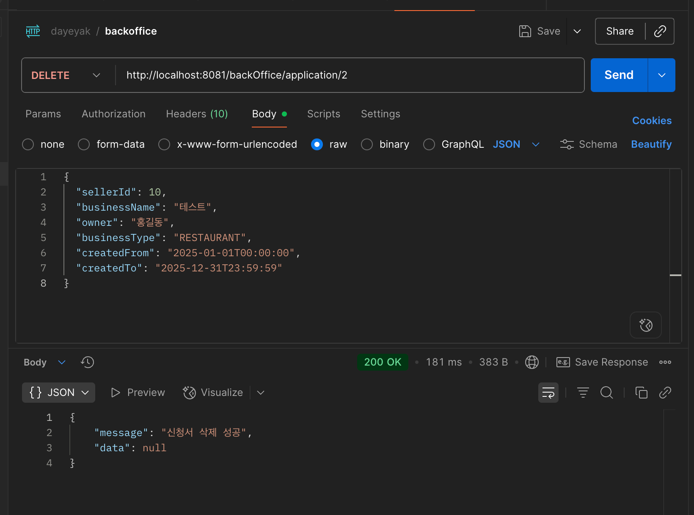

## 📝 요약(Summary)
사업 신청서 생성, 수정, 삭제, 조회(관련 검색어) 관리

## 💫 구현 및 변경 사항 (Details)
1. 사업 신청서 CRUD
2. 신청서 조회 시 사업장명, 사업주명, 사업 타입, 신청서 생성일 기간 검색 가능

## 📸스크린샷

## ✅ 체크리스트

- [X] 코드 정상 작동 테스트 완료
- [ ] 관련 문서(API 문서, 위키 등) 업데이트
- [x] 팀의 코드 컨벤션/스타일 가이드 준수
- [ ] Reviewers에 팀원 등록

## 💬 TODO ( 미완성일 경우 )
1. 서비스 CRUD 이벤트 발행

## 기타/주의사항