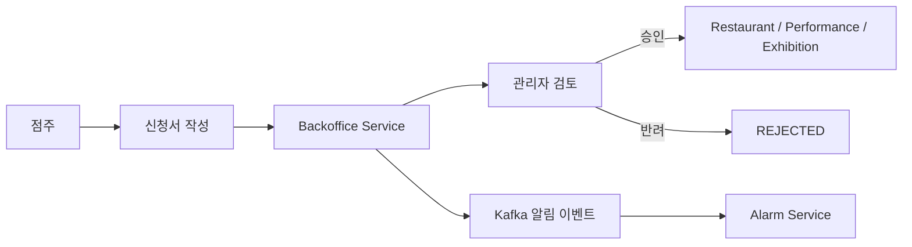
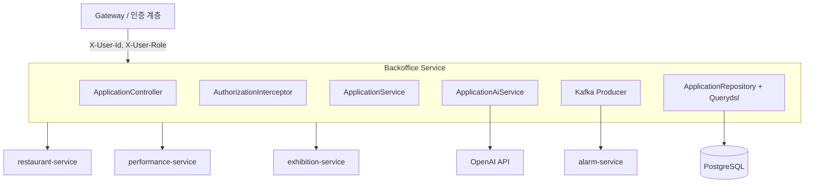
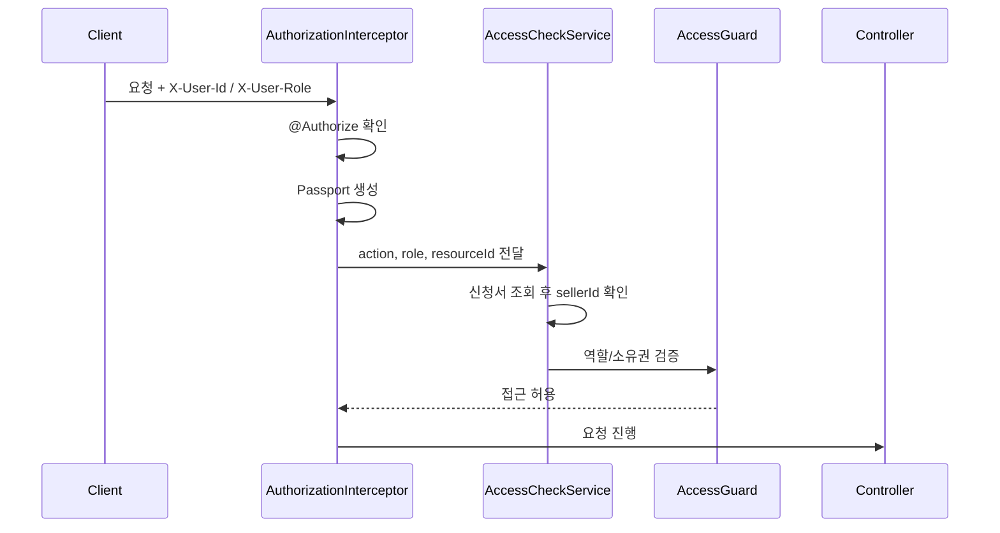
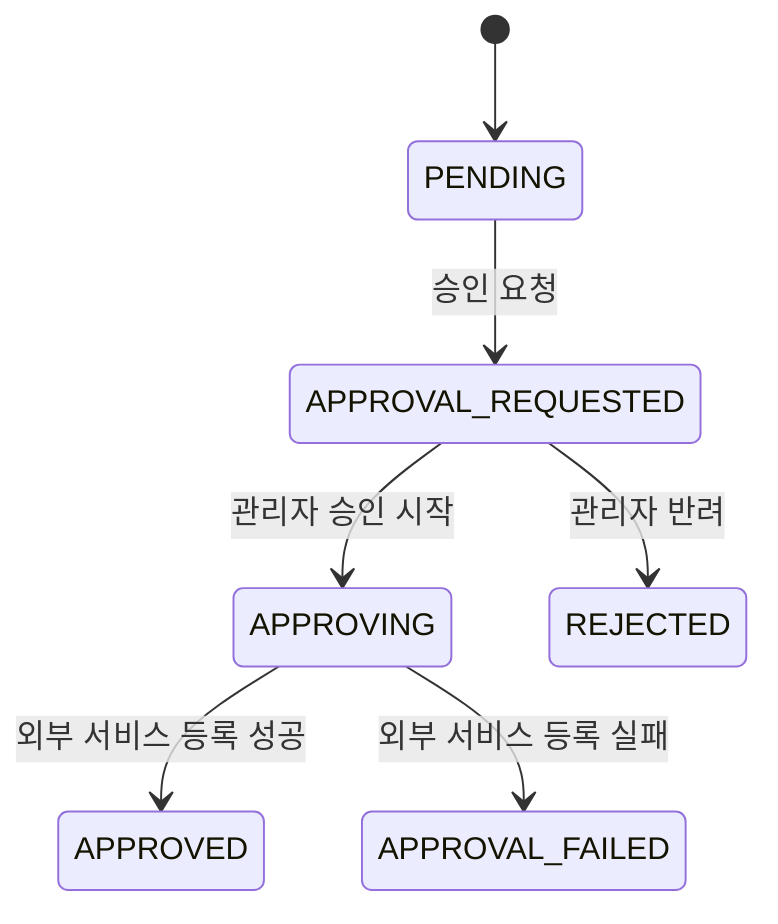

# Backoffice Service

DayeYAK 플랫폼의 서비스 등록 신청과 관리자 승인 프로세스를 담당하는 백오피스 서비스입니다.

기능 구현 자체보다 승인 흐름, 권한 검증, 외부 서비스 연동 과정에서 발생한 설계 판단과 문제 해결 과정을 중심으로 정리했습니다.

## 핵심 요약

- `@Authorize` 기반 선언형 권한 검증 구조로 API별 접근 정책과 소유권 검증을 분리했습니다.
- 상태 전이 기반 승인 프로세스로 승인 시작, 승인 성공, 승인 실패를 운영자가 추적할 수 있도록 설계했습니다.
- `afterCommit` 기반 Kafka 발행으로 DB 상태와 알림 이벤트의 불일치 가능성을 줄였습니다.
- OpenAI 검토 보조 기능은 승인 판단과 분리해 외부 AI 장애가 핵심 승인 흐름에 영향을 주지 않도록 구성했습니다.

## 프로젝트 소개

DayeYAK은 음식점, 공연, 전시 등 여러 서비스를 하나의 플랫폼에서 등록하고 예약할 수 있도록 구성한 MSA 기반 프로젝트입니다.

`backoffice-service`는 점주가 제출한 등록 신청서를 관리하고, 관리자가 승인/반려할 수 있도록 합니다. 승인된 신청서는 사업 유형에 따라 각 도메인 서비스로 전달됩니다.


```mermaid
flowchart LR
    Seller[점주] --> App[신청서 작성]
    App --> Backoffice[Backoffice Service]
    Backoffice --> Review[관리자 검토]
    Review -->|승인| Domain[Restaurant / Performance / Exhibition]
    Review -->|반려| Rejected[REJECTED]
    Backoffice --> Kafka[Kafka 알림 이벤트]
    Kafka --> Alarm[Alarm Service]
```

## 내가 담당한 영역

프로젝트 전체가 여러 도메인 서비스로 구성되어 있기 때문에, 제가 맡은 영역은 `신청서 승인 흐름을 안정적으로 관리하고 다른 서비스와 연결하는 백오피스 기능`입니다.

| 구분 | 내용 |
| --- | --- |
| 내가 구현/정리한 영역 | 신청서 CRUD, 조건 검색, 승인/반려 상태 전이, 권한 검증 구조, Feign 연동, Kafka 발행 시점 정리, AI 검토 보조 |
| 연동한 팀 서비스 | restaurant-service, performance-service, exhibition-service, alarm-service |
| 팀 전체 영역 | 각 도메인 서비스의 실제 등록 처리, alarm-service의 Kafka consumer/SSE 알림 |

## 핵심 기술 포인트

- `@Authorize` 기반 선언형 권한 검증 구조 설계
- 상태 전이 기반 승인 프로세스 설계
- `afterCommit` 기반 Kafka 이벤트 발행
- OpenAI 검토 보조 기능 설계

## 기술 스택

- Java 17, Spring Boot 3.5.5
- Spring Web, Spring Data JPA, Querydsl
- PostgreSQL
- Spring Cloud OpenFeign, Eureka Client
- Spring Kafka
- Spring Security 기본 설정, Custom Interceptor 기반 인가
- OpenAI API, Spring RestClient

## 전체 아키텍처


```mermaid
flowchart TB
    Gateway[Gateway / 인증 계층]
    Gateway -->|X-User-Id, X-User-Role| Backoffice

    subgraph Backoffice[Backoffice Service]
        Controller[ApplicationController]
        Auth[AuthorizationInterceptor]
        Service[ApplicationService]
        AI[ApplicationAiService]
        KafkaProducer[Kafka Producer]
        Repository[ApplicationRepository + Querydsl]
    end

    Backoffice --> Restaurant[restaurant-service]
    Backoffice --> Performance[performance-service]
    Backoffice --> Exhibition[exhibition-service]
    KafkaProducer --> Alarm[alarm-service]
    AI --> OpenAI[OpenAI API]
    Repository --> DB[(PostgreSQL)]
```

## Querydsl 동적 검색

관리자는 신청서를 사업 유형, 사업자 등록번호, 사업장명, 대표자명, 생성일 범위 등 여러 조건으로 조회해야 했습니다. 검색 조건은 매번 달라질 수 있고, 여러 조건을 동시에 조합할 수 있어야 했기 때문에 고정된 repository 메서드만으로는 관리 화면의 검색 요구사항을 처리하기 어려웠습니다.

이를 위해 `ApplicationRepositoryImpl`에서 Querydsl `BooleanBuilder`를 사용해 신청서 ID, 판매자 ID, 사업자 등록번호, 사업장명, 대표자명, 사업 유형, 생성일 범위를 동적으로 조합했습니다.

이 방식으로 조건별 repository 메서드를 늘리지 않고, 관리자 검색 화면에서 다양한 조건을 하나의 조회 흐름으로 처리할 수 있도록 했습니다.

## 권한 검증 구조 설계

### 왜 필요했나

백오피스는 일반 조회 API보다 권한 조건이 복잡했습니다.

실제 요구사항은 다음과 같았습니다.

- 점주는 본인이 작성한 신청서만 조회/수정할 수 있어야 함
- 관리자는 신청서를 승인/반려할 수 있어야 함
- 일반 사용자는 백오피스 기능에 접근하면 안 됨
- API마다 필요한 action이 다름
- 일부 API는 resourceId를 기준으로 소유권 검증이 필요함

이 조건을 컨트롤러마다 `if`문으로 처리하면 API가 늘어날수록 권한 로직이 흩어지고, 승인/반려 같은 중요한 기능에서 누락이 발생할 수 있다고 판단했습니다.

### 설계

권한 검증을 컨트롤러 내부 로직에서 분리하고, 선언형 어노테이션과 인터셉터 기반으로 구성했습니다.

Spring Security는 CSRF 비활성화와 기본 `SecurityFilterChain` 설정 수준으로 사용했고, 실제 인가 판단은 `AuthorizationInterceptor`, `AccessCheckService`, `AccessGuard`가 담당합니다.

| 구성 요소 | 역할 |
| --- | --- |
| `@Authorize` | API별 필요한 action, resourceId, owner 검증 여부 선언 |
| `AuthorizationInterceptor` | 요청 헤더에서 사용자 정보를 추출하고 권한 검증 실행 |
| `PassportHolder` | Controller에서 인증 사용자 정보를 주입받기 위한 ArgumentResolver |
| `AccessCheckService` | 리소스 조회 후 소유권 검증에 필요한 sellerId 제공 |
| `AccessGuard` | MASTER, SELLER, NORMAL 역할별 접근 정책 적용 |


```mermaid
sequenceDiagram
    participant Client
    participant Interceptor as AuthorizationInterceptor
    participant AccessCheck as AccessCheckService
    participant Guard as AccessGuard
    participant Controller

    Client->>Interceptor: 요청 + X-User-Id / X-User-Role
    Interceptor->>Interceptor: @Authorize 확인
    Interceptor->>Interceptor: Passport 생성
    Interceptor->>AccessCheck: action, role, resourceId 전달
    AccessCheck->>AccessCheck: 신청서 조회 후 sellerId 확인
    AccessCheck->>Guard: 역할/소유권 검증
    Guard-->>Interceptor: 접근 허용
    Interceptor->>Controller: 요청 진행
```

### 효과

- API마다 권한 정책을 `@Authorize`로 명시 가능
- 권한 검증과 비즈니스 로직 분리
- 소유권 검증 누락 가능성 감소
- 승인/반려 API처럼 민감한 기능의 접근 정책을 일관되게 관리

## 상태 전이 기반 승인 프로세스 설계

### 왜 필요했나

승인은 단순히 신청서 상태만 `APPROVED`로 바꾸는 기능이 아니었습니다.

관리자가 승인하면 백오피스는 신청서의 사업 유형에 따라 다른 도메인 서비스로 등록 요청을 보내야 합니다.

```text
RESTAURANT  -> restaurant-service
PERFORMANCE -> performance-service
EXHIBITION  -> exhibition-service
```

문제는 이 호출들이 하나의 DB 트랜잭션이 아니라는 점입니다.

```text
backoffice-service transaction != restaurant-service transaction
```

따라서 외부 서비스 등록 실패를 상태로 남기지 않으면, 운영자가 어떤 신청서가 승인 중 실패했는지 추적하기 어렵습니다.

### 설계

승인 상태를 다음과 같이 세분화했습니다.


```mermaid
stateDiagram-v2
    [*] --> PENDING
    PENDING --> APPROVAL_REQUESTED: 승인 요청
    APPROVAL_REQUESTED --> APPROVING: 관리자 승인 시작
    APPROVING --> APPROVED: 외부 서비스 등록 성공
    APPROVING --> APPROVAL_FAILED: 외부 서비스 등록 실패
    APPROVAL_REQUESTED --> REJECTED: 관리자 반려
```

핵심 로직은 다음 흐름입니다.

```java
application.startApproval();
repository.saveAndFlush(application);

try {
    registerExternalService(application, userId, role);
} catch (BusinessException e) {
    application.failApproval();
    repository.save(application);
    throw e;
}

application.approve();
repository.save(application);
```

`saveAndFlush()`는 승인 처리 시작 상태인 `APPROVING`을 코드 흐름상 명확히 분리하기 위해 사용했습니다. flush가 commit을 의미하지는 않지만, 외부 서비스 호출 전에 승인 시작 상태를 반영하는 단계와 외부 서비스 등록 단계를 분리해 승인 흐름을 더 명시적으로 표현했습니다.

외부 서비스 등록 실패 시에는 `failApproval()`로 `APPROVAL_FAILED` 상태를 저장하고, `@Transactional(noRollbackFor = BusinessException.class)` 설정으로 `BusinessException` 기반 실패 상태가 롤백되지 않도록 했습니다.

### 적용 전

- 승인 중 실패 상황을 상태로 설명하기 어려움
- 외부 서비스 호출 실패 시 실패 신청서를 추적하기 어려움
- 분산 트랜잭션처럼 자동 롤백된다고 오해하기 쉬움

### 적용 후

- 승인 처리 중 상태와 실패 상태를 명확히 구분
- 실패 신청서를 `APPROVAL_FAILED`로 남겨 관리자 확인 가능
- 승인 실패가 단순 예외로 사라지지 않고 운영 가능한 상태로 남음

상태 전이 설계의 핵심 비즈니스 가치는 `승인 실패를 놓치지 않는 것`입니다.

## Kafka 이벤트 발행 시점 설계

### 왜 필요했나

승인 요청, 승인 완료, 반려 완료 시 alarm-service로 알림 이벤트를 보내야 했습니다.

하지만 Kafka를 트랜잭션 내부에서 바로 발행하면 다음 문제가 발생할 수 있습니다.

```text
1. 신청서 상태 변경
2. Kafka 승인 알림 발행
3. 이후 로직에서 예외 발생
4. DB 트랜잭션 롤백
5. 사용자는 승인 알림을 이미 수신
```

즉, DB에는 승인 상태가 없는데 사용자는 승인 알림을 받는 불일치가 생길 수 있습니다.

### 설계

Kafka 이벤트는 DB 커밋 성공 이후에만 발행하도록 `afterCommit`으로 이동했습니다.

```java
private void sendRegisterResultAfterCommit(String topic, ServiceRegisterRequestDto dto) {
    if (TransactionSynchronizationManager.isSynchronizationActive()) {
        TransactionSynchronizationManager.registerSynchronization(new TransactionSynchronization() {
            @Override
            public void afterCommit() {
                producerService.sendRegisterResult(topic, null, dto);
            }
        });
    } else {
        producerService.sendRegisterResult(topic, null, dto);
    }
}
```

### 적용 후

- DB 커밋 성공 이후에만 Kafka 이벤트 발행
- 롤백된 신청서에 대한 알림 발행 방지
- 승인 요청/승인/반려 이벤트의 발행 기준 통일

## OpenAI 검토 보조 기능 설계

### 왜 필요했나

관리자는 신청서 승인/반려 전 사업장명, 대표자, 사업자 등록번호, 주소, 연락처 등을 확인해야 합니다.

AI 기능은 이 검토 시간을 줄이기 위한 보조 기능으로 설계했습니다.
핵심은 AI가 판단자가 되지 않도록 제한하는 것이었습니다.

### 설계

```text
POST /backoffice/applications/{applicationId}/ai-review
```

OpenAI API는 외부 의존성이며 항상 실패 가능성이 있습니다.

따라서 다음 원칙으로 설계했습니다.

- AI 결과는 DB에 저장하지 않음
- AI 실패가 승인/반려 프로세스에 영향을 주지 않도록 분리
- AI가 최종 승인/반려를 결정하지 않도록 프롬프트에 명시
- 승인 사유와 반려 사유가 동시에 나오면 서버에서 단일 방향으로 보정
- OpenAI API 장애 또는 JSON 파싱 실패 시 신청서 필드 기반 fallback 응답 제공

서버 측에서도 AI 응답을 그대로 믿지 않고 보정합니다.

```java
private AiReviewResult selectSingleDirection(AiReviewResult result) {
    if (hasAnyReason(result.rejectionReasons())) {
        return new AiReviewResult(result.summary(), List.of(), result.rejectionReasons());
    }
    if (hasAnyReason(result.approvalReasons())) {
        return new AiReviewResult(result.summary(), result.approvalReasons(), List.of());
    }
    return new AiReviewResult(result.summary(), List.of(), List.of());
}
```

### 효과

- AI 장애가 핵심 승인 플로우를 막지 않음
- AI 응답이 불안정해도 기본 검토 응답 제공 가능
- 관리자는 AI 결과를 참고하되, 최종 판단은 직접 수행

## 트러블슈팅

### Kafka Serializer 혼선 정리

Kafka 설정에서는 `application.yml`과 Java Config의 serializer 설정이 달라 실제 어떤 설정이 적용되는지 혼선이 있었습니다.

MSA에서는 producer와 consumer의 DTO 패키지명이 다를 수 있습니다. 이때 Java class type header를 메시지에 포함하면 서비스 간 결합이 생길 수 있습니다.

### 해결

- `JsonSerializer` 기준으로 설정 통일
- `JsonSerializer.ADD_TYPE_INFO_HEADERS=false` 적용
- Java class가 아니라 JSON payload 구조를 기준으로 통신하도록 정리

- alarm-service가 자기 DTO 기준으로 메시지를 역직렬화 가능
- 서비스 간 패키지명 의존 감소
- Kafka 설정을 설명 가능한 구조로 정리

---

### 승인 요청 알림과 승인 결과 알림의 목적 혼선

승인 요청 알림은 관리자에게 가야 하고, 승인/반려 결과는 신청자에게 가야 합니다.

두 이벤트는 DTO와 토픽이 다릅니다.

| 이벤트 | DTO | Topic |
| --- | --- | --- |
| 승인 요청 | `BackofficeRegisterDto` | `register` |
| 승인/반려 결과 | `ServiceRegisterRequestDto` | `restaurant`, `performance`, `exhibition` |

### 해결

- 승인 요청은 `register` 토픽으로 고정
- 승인/반려 결과는 사업 유형별 토픽으로 발행

### 효과

- alarm-service listener가 기대하는 topic/DTO 구조와 일치
- 관리자 알림과 신청자 결과 알림의 책임 분리

## 성과 및 효과

- 승인 실패를 단순 예외가 아니라 `APPROVAL_FAILED` 상태로 관리해 운영자가 실패 건을 확인하고 후속 조치를 수행할 수 있도록 구성
- 권한 검증을 선언형 구조로 분리해 API별 접근 정책을 명확하게 표현
- Kafka 발행 시점을 커밋 이후로 조정해 승인 상태와 알림 상태의 불일치 가능성 감소
- AI 검토 보조 기능을 핵심 승인 로직과 분리해 외부 API 장애가 승인 흐름에 영향을 주지 않도록 설계
- Feign, Kafka, AI API 같은 외부 의존성을 각각 다른 실패 가능성으로 보고 대응 방식을 분리

## 배운 점

- MSA에서 `@Transactional`은 서비스 경계를 넘지 않으므로, 외부 서비스 호출 실패를 상태로 추적할 수 있어야 합니다.
- 권한 검증은 요구사항이 복잡해질수록 컨트롤러 내부 조건문보다 선언형 구조로 분리하는 편이 유지보수에 유리합니다.
- Kafka는 발행 코드보다 발행 시점이 중요하며, DB 커밋 이후 발행해야 상태 불일치를 줄일 수 있습니다.
- AI 기능은 실패를 전제로 설계해야 하며, 최종 판단이 아니라 보조 기능으로 제한하는 것이 안전합니다.

## 실행 방법

### 환경 변수

```env
DB_URL=jdbc:postgresql://localhost:5432/backoffice
DB_USERNAME=postgres
DB_PASSWORD=password
SERVER_PORT=11100
KAFKA_BOOTSTRAP_SERVERS=localhost:9092
EUREKA_DEFAULT_ZONE=http://localhost:8761/eureka
OPENAI_API_KEY=
```

### 테스트

```bash
./gradlew test
```

### 실행

```bash
./gradlew bootRun
```

## 주요 API

현재 경로는 실제 코드에 정의된 값을 그대로 표기했습니다. 기존 Application API는 `/backOffice/application`, AI Review API는 `/backoffice/applications` 경로를 사용합니다. 신규 API라면 소문자 경로로 통일하는 것이 좋습니다.

| Method | Path | 설명 |
| --- | --- | --- |
| `POST` | `/backOffice/application` | 신청서 생성 |
| `GET` | `/backOffice/application/{id}` | 신청서 단건 조회 |
| `GET` | `/backOffice/application` | 신청서 조건 검색 |
| `PUT` | `/backOffice/application/{id}` | 신청서 수정 |
| `DELETE` | `/backOffice/application/{id}` | 신청서 삭제 |
| `POST` | `/backOffice/application/{id}/register` | 승인 요청 |
| `POST` | `/backOffice/application/{id}/approve` | 승인 |
| `POST` | `/backOffice/application/{id}/reject` | 반려 |
| `POST` | `/backoffice/applications/{applicationId}/ai-review` | AI 검토 보조 |

## 참고

- 현재 backoffice-service는 Kafka consumer가 아니라 producer 중심 서비스입니다.
- 알림 소비와 SSE 전송은 alarm-service에서 담당합니다.
- restaurant/performance/exhibition의 실제 등록 처리는 각 도메인 서비스가 담당합니다.
- Redis, 좌석 예약 동시성 제어, fetch join 기반 조회 최적화는 restaurant-service 영역입니다.
